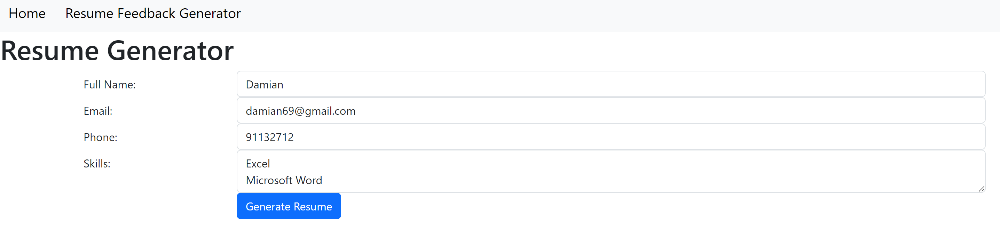

<h1 class="rizzume-heading">Rizzume</h1>

A website by MyarioVision, to create a resume to "rizz" up your employees into calling you over for an interview  :)

## Team Name: MyarioVision

## Proposed Level of Achievement:
Apollo 11

## Motivation

As university students, we understand the challenge of crafting a resume that stands out to potential employers. Many of our peers struggle with presenting their experiences and skills effectively, often due to a lack of knowledge about professional resume formatting or the latest trends in job applications. We also recognize the stress of staying updated with job openings while balancing academic and social commitments. Inspired by these experiences and driven by our passion for coding and technology, we decided to create Rizzume, a web application designed to simplify and enhance the resume creation process.

## Aim
To provide users with a comprehensive web application that streamlines the resume creation process, offers multiple templates, generates AI-driven feedback, stores different versions of resumes securely, and keeps users updated with the latest job openings in Singapore.

## User Stories
1) As a university student looking to apply for internships, I want to input my personal details and job experience easily so that I can generate a professional-looking resume quickly.
2) As a recent graduate preparing for job applications, I want to choose from multiple resume templates to ensure my resume reflects my unique style and stands out to employers.
3) As a job seeker wanting to improve my resume, I want to receive AI-generated feedback on my resume to identify areas of improvement.
4) As a busy professional looking to manage multiple job applications, I want to store multiple versions of my resume securely and download them as needed.
5) As a job seeker staying updated with job opportunities, I want access to the latest job updates in Singapore directly from the app.

## Features

#### Resume Generation:
Input data such as name, email, work experience, skills, and languages.
Automatically generate polished resumes based on the provided information.
Offer multiple templates to choose from, catering to different styles and job roles.

#### PDF Download:
Download the created resumes in PDF format for immediate use.

#### Sample Resumes:
Provide multiple sample resumes for users to explore and gain inspiration.
Allow users to search for specific samples based on job scope.

#### Resume Storage:
Save created resumes securely within the application.
Allow users to name and retrieve their resumes anytime.

#### AI Feedback:
Generate feedback for personal resumes using AI.
Limit the number of feedback requests to manage server load and maintain quality.

#### Job Updates:
Provide a dedicated tab for job searches with the latest job updates in Singapore.
Ensure users have access to up-to-date job listings.

## Timeline
The timeline spans 13 weeks, starting from May 3 and ending on August 3, including a buffer week to ensure completion before Splashdown.

Milestone 1 - Learning the Required Technologies (1 week):

Learn about Flask or Django.
Familiarize with Git for version control.
Solidify machine learning concepts and algorithms.
Milestone 2 - Technical Proof of Concept (1 week):

Implement a minimal working system integrating frontend and backend.
Create Feature 1 to collect user input and generate a simple resume.
Develop a basic design for the web application.
Milestone 3 - Prototype (5.5 weeks):

Expand the system to include the remaining core features.
Implement user authentication for secure access.
Develop a user-friendly interface for interacting with the app's features.
Test the prototype with a small group of users for feedback and bug identification.
Milestone 4 - Extended System (5.5 weeks):

Enhance the system with extended features, including AI feedback and job updates.
Implement advanced machine learning algorithms for feedback generation.
Improve the scalability, performance, and reliability of the application.
Conduct thorough testing, including unit tests, integration tests, and user acceptance testing.
Tech Stack

Frontend: HTML, CSS, Bootstrap, JavaScript
Backend: Flask or Django (Python)
Machine Learning: Pandas, Sci-kit Learn, TensorFlow
Database: SQLite or MySQL

