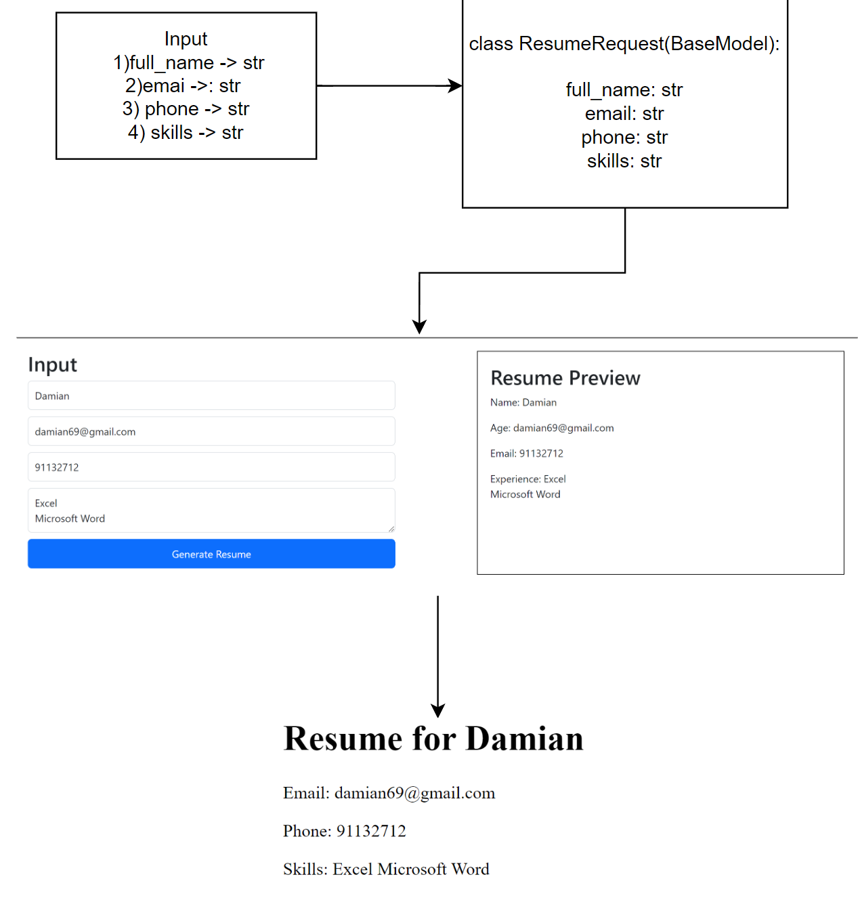
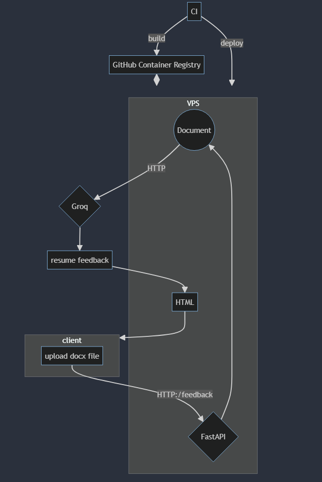
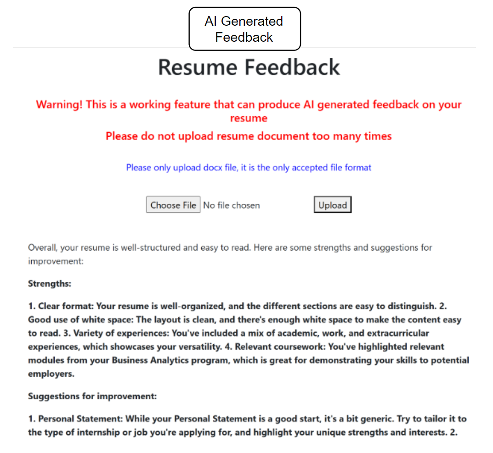

  <h1>Rizzume</h1>

A website by MyarioVision, to create a resume to "rizz" up your employees into calling you over for an interview  :)

#### Tech Stack

## Team Name

 MyarioVision 

## Proposed Level of Achievement

Apollo 11

## Motivation

As university students, we understand the challenge of crafting a resume that stands out to potential employers. Many of our peers struggle with presenting their experiences and skills effectively, often due to a lack of knowledge about professional resume formatting or the latest trends in job applications. We also recognize the stress of staying updated with job openings while balancing academic and social commitments. Inspired by these experiences and driven by our passion for coding and technology, we decided to create Rizzume, a web application designed to simplify and enhance the resume creation process.

## Aim

To provide users with a comprehensive web application that streamlines the resume creation process, offers multiple templates, generates AI-driven feedback, stores different versions of resumes securely, and keeps users updated with the latest job openings in Singapore.

## User Stories

1) As a university student looking to apply for internships, I want to input my personal details and job experience easily so that I can generate a professional-looking resume quickly.
2) As a recent graduate preparing for job applications, I want to choose from multiple resume templates to ensure my resume reflects my unique style and stands out to employers.
3) As a job seeker wanting to improve my resume, I want to receive AI-generated feedback on my resume to identify areas of improvement.
4) As a busy professional looking to manage multiple job applications, I want to store multiple versions of my resume securely and download them as needed.
5) As a job seeker staying updated with job opportunities, I want access to the latest job updates in Singapore directly from the app.

## Features

#### 1) Resume Generation

Input data such as name, email, work experience, skills, and languages.
Automatically generate polished resumes based on the provided information.
Offer multiple templates to choose from, catering to different styles and job roles.

#### 2) PDF Download

Download the created resumes in PDF format for immediate use.

#### 3) Sample Resumes

Provide multiple sample resumes for users to explore and gain inspiration.
Allow users to search for specific samples based on job scope.

#### 4) Resume Storage

Save created resumes securely within the application.
Allow users to name and retrieve their resumes anytime.

#### 5) AI Feedback

Generate feedback for personal resumes using AI.
Limit the number of feedback requests to manage server load and maintain quality.

#### 6) Job Updates

Provide a dedicated tab for job searches with the latest job updates in Singapore.
Ensure users have access to up-to-date job listings.

## Instructions of Usage:

-> Go to [Rizzume](https://mariooohzc-rizzume.hf.space/)
Navigation Bar  | Steps
------------- | -------------
Generate Resume  | 1) Input your details 2) Look at the preview on the right side 3) Click on **Generate Resume** to get your resume
Resume AI Generator  | Submit a **docx file** of your resume and press upload, then wait for the AI to generate the feedback for you.  ❗Take note that there is limited number of submits each user can have ❗

## System Design

### Feature 1

### Feature 2

## Timeline (Development Plan)

#### Milestone 1 - Learning the Required Technologies and showing Technical Proof of Concept

3rd and 4th week of May: Study Python, HTML, CSS and JavaScript\
5th week of May: Study FastAPI through tutorials and documentation. Code out at least one feature to have a minimal working system integrating backend and front end for the Technical Proof of Concept\
Learn FastAPI, Python, HTML, CSS, JavaScript. Familiarize with Git for version control. Learn Docker and Github Actions for CI/CD

#### Milestone 2 - Prototype

1st week of June: Familiarise with Latex for the creation of resume templates\
2nd week of June: Start coding out other essential features of the resume. Develop a user-friendly interface for interacting with the app's features\
3rd week of June: Testing and debugging

#### Milestone 3 - Extensions

1st week of July: Implementations of peer teams' suggestions\
2nd week of July: Expand the system to include the remaining core features\
3rd week of July: Testing and Debugging

1) Frontend: HTML, CSS, Bootstrap, JavaScript
2) Backend: FastAPI (Python)
3) Version Control and CI/CD: Git, Github, Github actions and docker

## Document system

### Milestone 1

Implemented Software engineering principle such as CI/CD using Docker and github actions\
Continuous Integration (CI) is achieved by configuring GitHub Actions to automatically build and test the application whenever changes are pushed to the main branch or when specific files (such as Python and HTML files) are updated. Continuous Deployment (CD) ensures that any successful build is automatically deployed to the managed VPS.

Our CI/CD pipeline consists of several workflows defined in the .github/workflows directory:

1) build.yml: This workflow builds and pushes the Docker image to the GitHub Container Registry (GHCR) whenever changes are detected such as when there is changes made to the html and py file
2) deploy.yml: This workflow deploys the Docker image to the managed VPS
3) warmer.yml: This workflow keeps the deployed application active by periodically sending requests to it every 2 days

Our AI resume feedback feature is completed and works well whereas the resume generator feature is not fully completed. Nonetheless, the resume generator feature include essential components such as form input retention. This is done by ensuring user's form data is saved in the browser's local storage so that inputs are not lost if the page reloads accidentally. There is also a live preview of the resume as users fill out the form.\
The inputRetainer function, which is in the javascript file located in the static/js directory, checks if the browser supports web storage. It attaches an event listener to each form input field to save its value to local storage whenever the user types.
Complexity of this function is high as it requires extensive knowledge of modern JavaScript APIs in the web browsers

Our AI resume feedback generator entails using python-docx library and groq api.  This feature allows users to upload their resumes in .docx format and receive feedback from an AI model on how to improve their resumes. It took me a while to code out this feature as I was not familiar with Python asynchronous programming. I realised that UploadFile uses a spooled file according to the FastAPI documentation and UploadFile.read() is an asynchronous function and hence, await keyword is needed and BytesIO is required to convert it to readable file for Document().
